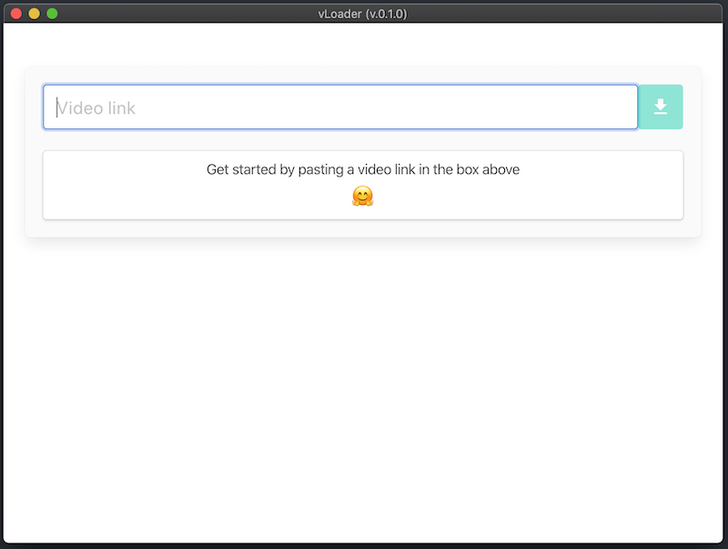

# vLoader

An extremely simple, no frills, video downloader. This app should run on any platform (tested on Mac OSX) and should let you download videos from (almost) anywhere on the internet (see [supported sites](https://github.com/ytdl-org/youtube-dl/blob/master/docs/supportedsites.md) for an exhaustive list).

# Installation and usage

1. Download the latest release from the [releases page](https://github.com/muhummadPatel/vLoader/releases)
2. Extract the downloaded .zip file and copy the included vLoader.app file to your Applications folder to install the app on your Mac
3. The first time you open the app, it will need to download the required [youtube-dl](http://ytdl-org.github.io/youtube-dl/) binary for you. You should be presented with a dialog box like this:  Dismiss this box by clicking ok
4. The app should complete it's setup in a minute or two and you should then be presented with the screen below. If not, quit the app (Cmd-Q) and reopen it.
5. Once the app is open, you will be presented with the screen shown below. To download a video, paste the video URL/link (e.g. 'https://www.youtube.com/watch?v=4LWmRuB-uNU') in the 'Video link' box and either hit Enter or click the green download button. Your video should begin to download shortly 
6. You can repeat step 5 to download as many videos as you like in parallel!

# Todo

I really only built this as a way to experiment with Javascript, React, and Electron so it's really not a very polished product. The following are a list of improvements for the future (pull-requests welcome):

- [ ] Proper Error Handling (don't just pop up dialogs when things fail)
- [ ] Allow user to select from the available formats before downloading the video
- [ ] Handle downloading playlists
- [ ] Add support for pausing/resuming downloads
- [ ] Persist the list of downloaded videos

# Contact

If you have any questions or need some help, please feel free to reach out by opening an [issue](https://github.com/muhummadPatel/vLoader/issues/new)
